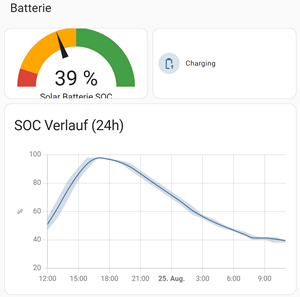

# Home Assistant integration für MaxxiCharge (und PowerOpti)
Mit den folgenden Anpassungen in deiner Home Assistant Umgebung kannst du deinen MaxxiCharge und (falls vorhanden) auch deinen PowerOpti einbinden.

> [!IMPORTANT]
> Update August 2025:
> Die MaxxiCharge Online API hat sich geändert, deshalb funktionieren die alten Statusabfragen nicht mehr. Ich habe die REST
> Abfragen in "maxxicharge_system.yaml" entsprechend angepasst. Neu dazugekommen ist die Datei "maxxicharge_config.yaml", in der die aktuelle Konfiguration
> Eurer MaxxiCharge Installation abgefragt werden kann - dort ist nun auch die Firmware Version zu finden.

Du brauchst nicht zwingend beide Integrationen, jede funktioniert auch für sich selbst.
## So könnte es dann aussehen

## Allgemeines
Die Integrationen funktionieren beide über RESTful Sensoren in Home Assistant. Ich habe die Integrationen bei mir in einzelne Dateien aufgeteilt, das kannst du genauso machen, oder aber den entsprechenden Code aus den jeweiligen Dateien in deine **configuration.yaml** übernehmen. Die Zugangsdaten habe ich in die **secrets.yaml** ausgelagert.
### secrets.yaml
In der secrets.yaml werden Zugangsdaten für PowerOpti und MaxxiCharge eingetragen. Je nach System brauchst du entweder dein Login bei PowerOpti, oder das bei MaxxiCharge, oder eben beide. Schau dir die Einträge in meiner **secrets.yaml** an, übertrage diese in deine Konfiguration und passe sie entsprechend an. Details siehe weiter unten. Füge die folgenden Daten in deine Datei hinzu ([Beispiel](secrets.yaml)):

    # Powerfox
    # Add and change these two lines to use PowerFox / PowerOpti
    powerfox_username: "YourEmailAddressHere"
    powerfox_password: "YourPowerOptiPasswordHere"
    
    # Maxxicharge
    # Add and change this line to use MaxxiCharge
    maxxicharge_login_payload: '{"email": "YourEmailHere", "ccu": "YourCCUHere"}'

### configuration.yaml
In der configuration.yaml muss die entsprechende RESTful Definition für MaxxiCharge und / oder PowerOpti gemacht werden. Da in meinem ersten Versuch die Datei sehr schnell unglaublich unübersichtlich wurde, habe ich mich dazu entschieden, die verschiedenen Integrationen in eigene Dateien im Unterordner **/rest/** aufzuteilen. Das macht die ganze Sache einfacher handhabbar.

**Wichtig:** Erstelle in deiner Home Assistant Installation **nur** die Dateien im Rest-Ordner, die du auch verwenden willst, sonst bekommst du ggf. Fehlermeldungen für die Integration, die du nicht verwenden willst / kannst.

**Konfiguration:** Wenn du in deiner **configuration.yaml** noch **keine** anderen Restful Sensoren konfiguriert hast, füge einfach die folgende Zeile in deine configuration.yaml ein ([Beispiel](configuration.yaml)):

    rest: !include_dir_merge_list rest

## MaxxiCharge
Um die MaxxiCharge Integration zu nutzen, benotigst du folgende Komponenten:
1. Den oben beschriebenen Eintrag in der **configuration.yaml**
2. Den Eintrag **maxxicharge_login_payload** in der **secrets.yaml**
3. Die beiden Dateien [maxxicharge_auth.yaml](rest/maxxicharge_auth.yaml) und [maxxicharge_system.yaml](rest/maxxicharge_system.yaml) im **rest** Ordner

### Der Secrets-Eintrag
Den Eintrag in der Secrets für MaxxiCharge müsst ihr für eure Installation noch anpassen. Dabei müsst ihr die Zugangsdaten eintragen, die ihr auch für die Konfiguration eures MaxxiCharge Systems unter (https://maxxisun.app) verwendet.

    maxxicharge_login_payload: '{"email": "YourEmailHere", "ccu": "YourCCUHere"}'

Verwendet dazu eure E-Mail Adresse und die CCU ID der Webseite.

### Die Dateien
Grundsätzlich ist die Datei [maxxicharge_auth.yaml](rest/maxxicharge_auth.yaml) für die Anmeldung am MaxxiCharge Webservice zuständig, die [maxxicharge_system.yaml](rest/maxxicharge_system.yaml) liest die Sensordaten aus.

Zum Troubleshooting der Anmeldung könnt ihr die **Entitäten** prüfen, die mit **MaxxiCharge_Auth_** beginnen.

**Wichtig:** Der Webservice authentifiziert euch auch "erfolgreich", wenn ihr eine falsche ID eurer CCU eingebt! Also Vorsicht!

Die Sensordaten sind alle als **Entitäten** in Home Assistant verfügbar und beginnen mit **MaxxiChargeV2_**. Schaut in der [maxxicharge_system.yaml](rest/maxxicharge_system.yaml) nach, dort habe ich zu jedem Sensor auch geschieben, was dieser anzeigt.

## PowerOpti
Wenn ihr einen PowerOpti in eurer Umgebung einsetzt, könnt ihr diesen auch in HomeAssistant nutzen. Dazu braucht ihr:
1. Den oben beschriebenen Eintrag in der **configuration.yaml**
2. Die beiden **Poweropti** Einträge in der **secrets.yaml**
3. Die Datei [poweropti.yaml](rest/poweropti.yaml) im **rest** Ordner

### Der Secrets-Eintrag
Die beiden Einträge in der Secrets für PowerOpti müsst ihr für eure Installation noch anpassen. Benutzt dazu die E-Mail Adresse und das Passwort, mit dem ihr euch an eurer PowerOpti App angemeldet habt. Ihr könnt die Anmeldedaten testen, indem ihr [diese Seite](https://backend.powerfox.energy/api/2.0/my/main/current?unit=kwh) öffnet und mit E-Mail Adresse und Passwort anmeldet. Klappt das, habt ihr die richtigen Daten.

Tragt dazu die so geprüften Zugangsdaten in den folgenden beiden Variablen in der **secrets.yaml** ein:

    powerfox_username: "YourEmailAddressHere"
    powerfox_password: "YourPowerOptiPasswordHere"

### Die Dateien
Ihr müsst nur die Datei [poweropti.yaml](rest/poweropti.yaml) in den **rest** Ordner legen, die kümmert sich um Anmeldung und Abfrage der Sensordaten. Die Sensoren werden im HomeAssistant dann als Entitäten mit **PowerOpti** im Namen angezeigt. Auch hier sind die Infos zu den Entitäten in der yaml Datei zu finden.

**Viel Spaß beim Dashboard bauen!!**
